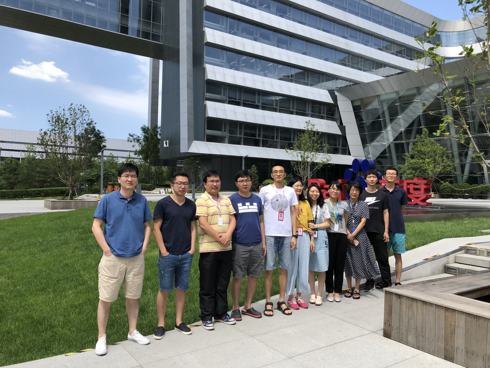

# Baidu NLP Dialogue team
  The dialogue team, at Baidu NLP, is a group of engineers and researchers who truly trust in technology and work together to accelerate the development of open-domain dialogues.
  
  Our battlefields include but not limited to the fundamental technology of neural dialogue system (seq2seq generation or context-response matching), knowledge-driven dialogue, life-long learning dialogue system with reinforcement-learning, and also we provide the system-level solution for open-domain chatbots. 
  
  Together we built the largest Chinese Human-Computer conversation systems and support many businesses such as DuerOS, the largest Chatbot in China, our life-long learning system interacts with hundreds of millions of Chinese users every day and learns through imitation/user-feedback, distilling knowledge from the conversation and learning to be smarter.
  
  We will release some source code of our previous work in the future, to make some small contribution to the whole community of human-computer conversation.
 
# Publication

> + [Multi-Turn Response Selection for Chatbots with Deep Attention Matching Network](http://aclweb.org/anthology/P18-1103). *ACL 2018, Full Paper*
> + [Multi-View Response Selection for Human-Computer Conversation](http://www.aclweb.org/anthology/D16-1036). *EMNLP 2016, Full Paper*
> + [Shall I be Your Chat Companion towards an Online Human-Computer Conversation System](http://research.baidu.com/Public/uploads/5acc2a6723f1d.pdf). *CIKM 2016, Full Paper*
 
# Connected to our Chatbot Service
  Any Chinese developers can enable their own smart devices to talk with customers on open-domain topics by using our open chatbot service. Please find the usage manual at http://ai.baidu.com/forum/topic/show/497679 (in Chinese).
 
# Our Members (part) (2018/06)

